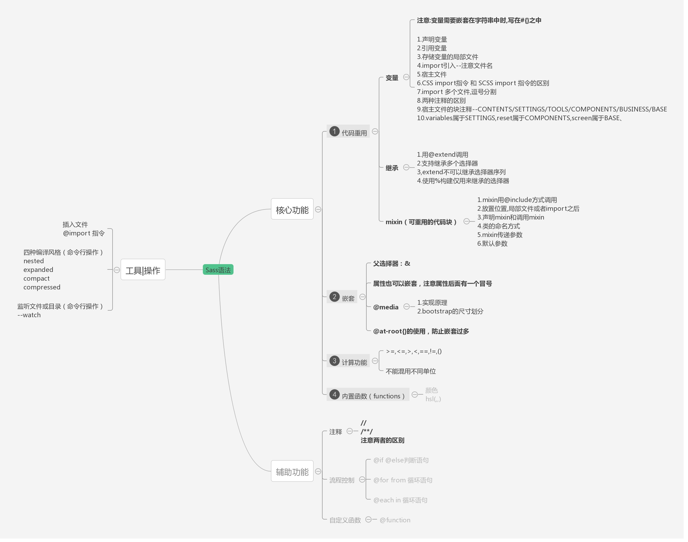

- [SASS 官网（中文）](http://sass.bootcss.com/)
- [SASS 官网（英文）](http://sass-lang.com/)

<br/>


**SASS 是什么**

> Sass is the most mature, stable, and powerful professional grade CSS extension language in the world.

Sass 是成熟、稳定、强大的 CSS 扩展语言。

**SASS 的特点**

兼容 CSS 语法、功能丰富、成熟

---

<!-- markdown-to-slides index.md -o index.html -s slide.css -->

## I. SASS 简介

**是 CSS 的扩展，是 CSS 的预处理。提供了许多便利的写法，大大节省了设计者的时间，使得 CSS 的开发，变得简单和可维护。**

sass 文件有两种文件名后缀，分别是 .sass 和 .scss，.sass 是严格的嵌套缩进规则，而 .scss 的则是跟写 css 代码类似的大括号，分号这样的语法规则。

CSS 预处理器技术已经非常的成熟，而且也涌现出了很多种不同的 CSS 预处理器语言，比如说：

- Sass（SCSS）
- LESS
- Stylus
- Turbine
- Swithch CSS
- CSS Cacheer
- DT CSS

到目前为止，在众多优秀的 CSS 预处理器语言中就属 Sass、LESS 和 Stylus 最优秀，讨论的也多，对比的也多。

---

### Sass 和 SCSS 区别

Sass 和 SCSS 其实是同一种东西，我们平时都称之为 Sass，两者之间不同之处有以下两点：

文件扩展名不同，Sass 是以“.sass”后缀为扩展名，而 SCSS 是以“.scss”后缀为扩展名

语法书写方式不同，Sass 是以严格的缩进式语法规则来书写，不带大括号({})和分号(;)，而 SCSS 的语法书写和我们的 CSS 语法书写方式非常类似。

```scss
$font-stack: Helvetica, sans-serif  //定义变量
$primary-color: #333 //定义变量

body
  font: 100% $font-stack
  color: $primary-color
```

```scss
$font-stack: Helvetica, sans-serif;
$primary-color: #333;

body {
  font: 100% $font-stack;
  color: $primary-color;
}
```

---

### 安装方法

```javascript

npm install sass -g

```

**使用方法**

```javascript

sass test.scss [test.css]

```

[sass 在线转换](https://www.sassmeister.com/)

---

### sass [编译风格](http://sass-lang.com/documentation/file.SASS_REFERENCE.html#output_style)的选项

SASS 提供四个编译风格的选项：

- **nested：嵌套缩进的 css 代码，它是默认值。**

- expanded：没有缩进的、扩展的 css 代码。

- compact：简洁格式的 css 代码。

- compressed：压缩后的 css 代码。

生产环境当中，一般使用最后一个选项。

```javascript

sass --style compressed test.sass test.css

```

你也可以让 SASS 监听某个文件或目录，一旦源文件有变动，就自动生成编译后的版本。

```javascript

sass --watch input.scss:output.css // watch a file
sass --watch app/sass:public/stylesheets // watch a directory

```

---

### 基本用法

**1.变量**

SASS 允许使用变量，所有变量以\$开头。

```scss
$blue: #1875e7;
div {
  color: $blue;
}
```

如果变量需要镶嵌在字符串之中，就必须需要写在#{}之中。

```scss
$side: left;
.rounded {
  border-#{$side}-radius: 5px;
}
```

**普通变量和默认变量**

sass 的默认变量一般是用来设置默认值，然后根据需求来覆盖的，覆盖的方式也很简单，只需要在默认变量之前重新声明下变量即可。

默认变量的价值在进行组件化开发的时候会非常有用。

---

```scss
$fontSize: 14px;
$fontSize: 12px !default;
body {
  font-size: $fontSize;
}
/*普通变量与默认变量*/
body {
  font-size: 14px;
}
```

**局部变量和全局变量**

从 3.4 版本开始，Sass 已经可以正确处理作用域的概念

```scss
$color: orange !default; //定义全局变量(在选择器、函数、混合宏...的外面定义的变量为全局变量)
.block {
  color: $color; //调用全局变量
}
em {
  $color: red; //定义局部变量
  a {
    color: $color; //调用局部变量
  }
}
span {
  color: $color; //调用全局变量
}
```

---

```scss
.block {
  color: orange;
}

em a {
  color: red;
}

span {
  color: orange;
}
```

**全局变量的影子**

当在局部范围（选择器内、函数内、混合宏内...）声明一个已经存在于全局范围内的变量时，局部变量就成为了全局变量的影子。基本上，局部变量只会在局部范围内覆盖全局变量。

同上一个例子

**什么时候声明变量？**

1. 该值至少重复出现了两次；
2. 该值至少可能会被更新一次；
3. 该值所有的表现都与变量有关（非巧合）。

基本上，没有理由声明一个永远不需要更新或者只在单一地方使用变量。

---

### 基本用法

**2.计算功能**

```scss
body {
  margin: (14px/2);
  top: 50px + 100px;
  right: $var * 10%;
}
```

**3.嵌套**

```scss
div {
  hi {
    color: red;
  }
}
```

**选择器嵌套**

&有 2 种用法：

1. 替换空格
2. 选择父类

---

```scss
nav {
  a {
    color: red;
    .b {
      & .c {
        font-size: 12px;
      }
      &:hover {
        color: green;
      }
    }
    head & {
      color: green;
    }
  }
}
```

```scss
nav a {
  color: red;
}
nav a .b .c {
  font-size: 12px;
}
nav a .b:hover {
  color: green;
}
head nav a {
  color: green;
}
```

---

**属性嵌套**

CSS 有一些属性前缀相同，只是后缀不一样，比如：border-top/border-right，与这个类似的还有 margin、padding、font 等属性。

```scss
.box {
  font: {
    size: 12px;
    weight: bold;
  }
}
```

```scss
.box {
  font-size: 12px;
  font-weight: bold;
}
```

**伪类嵌套**

```scss
.box {
  &:before {
    content: '伪元素嵌套';
  }
}
```

选择器嵌套最大的问题是将使最终的代码难以阅读，我们应该尽可能避免选择器嵌套。

---

### 基本用法

**4.注释**

SASS 共有两种注释风格。

标准的 CSS 注释 /_ comment _/ ，会保留到编译后的文件。

单行注释 // comment，只保留在 SASS 源文件中，编译后被省略。

在/\*后面加一个感叹号，表示这是"重要注释"。即使是压缩模式编译，也会保留这行注释，通常可以用于声明版权信息。

---

### css 代码的重用

**1.继承**

SASS 允许一个选择器，继承另一个选择器。比如，现有 class1：

```scss
.class1 {
  border: 1px solid #ddd;
}
```

class2 要继承 class1，就要使用@extend 命令：

```scss
.class2 {
  @extend .class1;
  font-size: 120%;
}
```

---

### css 代码的重用

**2.Mixin**

使用@mixin 命令，定义一个代码块。

```scss
@mixin left {
  float: left;
  margin-left: 10px;
}
```

使用@include 命令，调用这个 mixin。

```scss
div {
  @include left;
}
```

mixin 的强大之处，在于可以指定参数和缺省值。

```scss
@mixin left($value: 10px) {
  float: left;
  margin-right: $value;
}
```

---

### css 代码的重用

使用的时候，根据需要加入参数：

```scss
div {
  @include left(20px);
}
```

下面是一个 mixin 的实例，用来生成浏览器前缀。

```scss
@mixin rounded($vert, $horz, $radius: 10px) {
  border-#{$vert}-#{$horz}-radius: $radius;
  -moz-border-radius-#{$vert}#{$horz}: $radius;
  -webkit-border-#{$vert}-#{$horz}-radius: $radius;
}

#navbar li {
  @include rounded(top, left);
}

#footer {
  @include rounded(top, left, 5px);
}
```

---

### css 代码的重用

**3.颜色函数**

SASS 提供了一些内置的颜色函数，以便生成系列颜色。

```scss
lighten(#cc3, 10%) // #d6d65c
darken(#cc3, 10%) // #a3a329
grayscale(#cc3) // #808080
complement(#cc3) // #33c
```

**4.插入文件**

@import 命令，用来插入外部文件。

```scss
@import 'path/filename.scss';
```

如果插入的是.css 文件，则等同于 css 的 import 命令。

```scss
@import 'foo.css';
```

---

### sass 高级用法

**1.条件语句**

```scss
@if lightness($color) >30% {
  background-color: #000;
} @else {
  background-color: #fff;
}
```

**2.循环语句**

```scss
@for $i from 1 to 10 {
  .border-#{$i} {
    border: #{$i}px solid blue;
  }
}
```

```scss
$i: 6;
@while $i>0 {
  .item-#{$i} {
    width: 2em * $i;
  }
  $i: $i - 2;
}
```

---

### sass 高级用法

```scss
@each $member in a, b, c, d {
  .#{$member} {
    background-image: url('/image/#{$member}.jpg');
  }
}
```

**3.自定义函数**

SASS 允许用户编写自己的函数。

```scss
@function double($n) {
  @return $n * 2;
}

#sidebar {
  width: double(5px);
}
```

---

## II. SASS 总结



---

### path 路径操作模块

```javascript

path.join(__dirname, '../node_modules')

path.basename(path[, ext])

```


---

### node 中的其他成员

在每个模块中，除了 require、export 等模块相关的 API 之外，还有两个特殊的成员

- \_\_dirname 可以用来获取当前文件模块所属目录的绝对路径 **动态获取**
- \_\_filename 可以用来获取当前文件的绝对路径 **动态获取**

**1. 在文件操作路径中，相对路径设计的是相对于执行 node 命令所在路径**
**2. 模块中的路径标识就是相对于当前文件模块，不受执行 node 命令所处路径影响**

```javascript
const fs = require('fs')
const path = require('path')

// 文件操作中的相对路径
fs.readFile('c:/a/b/a.txt', 'utf-8', function(err, data) {
  if (err) throw err
  console.log(data)
})

// 文件操作中的相对路径转化为动态获取的绝对路径
fs.readFile(path.join(__dirname, './a.txt'), 'utf-8', function(err, data) {})

// 模块中的路径标识
require('./b')
```

---

## II. Express 中间件

**中间件（middleware）** 在 Node.js 中被广泛使用，它泛指一种特定的设计模式、一系列的处理单元、过滤器和处理程序，以函数的形式存在，连接在一起，形成一个异步队列，来完成对任何数据的预处理和后处理。

常规的中间件模式


---

### express 中间件

[express 中间件](http://www.expressjs.com.cn/guide/writing-middleware.html)

**Middleware functions are functions** that have access to the request object (req), the response object (res), and the next function in the application’s request-response cycle.

中间件的本质就是请求处理方法，把用户从请求到响应的整个过程分发到多个中间件中去处理，提高代码灵活性，动态可扩展


---

### 中间件的使用

```js
var express = require('express')
var app = express()
var myLogger = function(req, res, next) {
  console.log('LOGGED')
  next()
  console.log('After LOGGED')
}
var myLogger2 = function(req, res, next) {
  console.log('LOGGED2')
  next()
  console.log('After LOGGED2')
}
app.use(myLogger)
app.use(myLogger2)
app.listen(3000, function() {
  console.log('express app is runing .....')
})
```

project:demo-3.js 运行结果如下：


---

### 实现中间件机制

```js
function express() {
  var taskArrray = []
  var app = function(req, res) {
    var i = 0
    function next() {
      var task = taskArrray[i++]
      if (!task) {
        return
      }
      task(req, res, next)
    }
    next()
  }
  // 将中间件存入数组中
  app.use = function(task) {
    taskArrray.push(task)
  }

  return app
}
```

project:demo-4.js

---

### 实现中间件机制测试结果

```js
var http = require('http')
var app = express()
http.createServer(app).listen('3000', function() {
  console.log('listening 3000....')
})
var myLogger = function(req, res, next) {
  console.log('LOGGED')
  next()
  console.log('After LOGGED')
}
var myLogger2 = function(req, res, next) {
  console.log('LOGGED2')
  next()
  console.log('After LOGGED2')
}
app.use(myLogger)
app.use(myLogger2)
```


---

### express 中间件分类

应用层级别中间件

- 不关心请求路径和请求方法的中间件，任何请求都会执行
- 关心请求路径的中间件

路由级别中间件

- 不关心请求路径和请求方法的中间件，任何请求都会执行
- 严格匹配请求方法和请求路径的中间件

错误处理中间件

- 404 页面 全局错误页面

内置中间件

- express.static

第三方中间件

- body-parser
- cookie-session

---

### 使用 express 中间件

project:demo-5.js

```js
// 不关心请求路径和请求方法的中间件
app.use(function(req, res, next) {
  console.log('all request must execute!!')
  next()
})

app.use(function(req, res, next) {
  console.log('all request must execute 1 !!')
})

// 以/XXX 开头的路径的中间件
app.use(
  '/user/:id',
  function(req, res, next) {
    console.log('Request URL:', req.originalUrl)
    next()
  },
  function(req, res, next) {
    console.log('Request Type:', req.method)
    next()
  }
)

// 严格匹配请求方法和请求路径的中间件
app.get('/aa/bb', function(req, res, next) {
  console.log('/aa/bb')
  next()
})
```

---

### 使用 express 中间件

```js
// 内置中间件
app.use('/public/', express.static('./public/'))

// 所有都匹配不到时 404 （放在最后）
app.use('/', router)
app.use(function(req, res, next) {
  res.send('This is 404 !!!!!')
})

// 配置全局错误统一处理中间件
app.get('/aa/bb', function(req, res, next) {
  fs.readFile('c:/a/b/index.js', 'utf-8', function(err) {
    if (err) return next(err)
  })
})

app.use(function(err, req, res, next) {
  res.status(500).json({
    err_code: 500,
    err_msg: err.message
  })
})

// 第三方级别中间件
const bodyParser = require('body-parser')
app.use(bodyParser.urlencoded({ extended: false }))
app.use(bodyParser.json())
```

---

## III. Express Generator

通过应用生成器工具 express-generator 可以快速创建一个应用的骨架。

```js
npm install express-generator -g
express myapp --view=pug
cd myapp
npm install
npm run start
```

project:myapp 访问http://localhost:3000/


---

### 目录结构与代码

1.查看 myapp 目录结构

2.结合中间件分析代码

project: myapp


---

### 相关中间件

**morgan**

> HTTP request logger middleware for node.js

**pug**

> Pug is a high performance template engine heavily influenced by Haml and implemented with JavaScript for Node.js and browsers. For bug reports, feature requests and questions, open an issue. For discussion join the chat room.

```html
h1 Pug - node template engine
<h1>Pug - node template engine</h1>
```

```js
// compile
var fn = pug.compile('string of pug', options)
var html = fn(locals)

// render
var html = pug.render('string of pug', merge(options, locals))
```

---

## IV. express 在 vue 项目中模拟接口

结合 ccs-operation-web 中 模拟接口 ./api/server.js


project:app.js

---


---

### 运行 express 服务器

```js
"scripts": {
    "server": "nodemon api/server.js",
    "dev": "webpack-dev-server --inline --progress --open --config build/webpack.dev.conf.js",
    // 影响ccs-operation-web/config/proxyConfig.js http://localhost:3002/api/listContracts?pin=X&all=X
    "devlocal": "shell-exec --colored-output \"npm run dev --local\" \"npm run server\"",
  }

```

**shell-executor**

> A small nodejs module to execute shell commands in parallel

```js
npm i -g shell-executor
// --colored-output  Use colored output in logs
shell-exec --colored-output 'npm run lint' 'npm run test' 'npm run watch'

```

---

### ccs-operation-web ./api/server.js

```js
const express = require('express')
const bodyParser = require('body-parser')
const request = require('request')
const path = require('path')
const walk = require('klaw-sync')

const {
  origin_proxy_url,
  local_proxy_port,
  local_proxy_url
} = require('../config/proxyConfig')

const app = express()
app.use(bodyParser.urlencoded({ extended: false }))
app.use(bodyParser.json())
app.use(function(req, res, next) {
  res.header('Access-Control-Allow-Origin', '*')
  res.header(
    'Access-Control-Allow-Headers',
    'Origin, X-Requested-With, Content-Type, Accept'
  )
  next()
})

let _existRoutes = []
```

---

```js
app.use((req, res, next) => {
  const { url, body, method } = req
  if (!~_existRoutes.indexOf(req.path)) {
    const rurl = origin_proxy_url.replace(/\/$/, '') + url
    let r =
      method === 'POST'
        ? request.post({ url: rurl, form: body }, (err, httpRes, reqBody) => {
            console.log(err, reqBody, body)
          })
        : request(rurl)
    console.log(`本地未定义的请求，跳转到 ${method} ${rurl}`)
    req.pipe(r).pipe(res)
    return
  }
  next()
})

//遍历本目录下的 *.api.js
walk(path.resolve('./'))
  .filter(p => /\.api\.js$/.test(p.path))
  .map(p => p.path)
  .forEach(part => require(part)(app))

//记录注册过的路由
_existRoutes = app._router.stack.filter(s => s.route).map(s => s.route.path)

app.listen(local_proxy_port, () => {
  console.log(`\n\n local server running at ${local_proxy_url} \n\n`)
})
```

---

### klaw-sync

> klaw-sync is a Node.js recursive and fast file system walker

```js
// 用法
const klawSync = require('klaw-sync')
const paths = klawSync('/some/dir')
// paths = [{path: '/some/dir/dir1', stats: {}}, {path: '/some/dir/file1', stats: {}}]
```


---

### request

> Request - Simplified HTTP client

```js
// 用法
npm install request

var request = require('request');
request('http://www.google.com', function (error, response, body) {
  console.log('error:', error);
  console.log('statusCode:', response && response.statusCode);
  console.log('body:', body);
});

req.pipe(request('http://mysite.com/doodle.png')).pipe(resp)

```


---

## VI. 总结

express 基于 Node.js 平台，快速、开放、极简的 Web 开发框架

简单来说，封装了 node 中 http 核心模块，专注于业务逻辑的开发。

express 核心内容 ： 理解、使用中间件

[express 源码学习 路由](https://segmentfault.com/a/1190000013953688)
[express 中间件原理](https://www.jianshu.com/p/797a4e38fe77)

---

## 彩蛋


