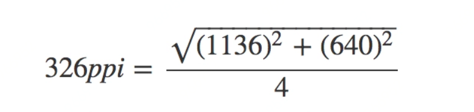

## 移动端 Web 页面适配方案

移动端 Web 页面，即常说的 H5 页面、手机页面、webview 页面等。

机设备屏幕尺寸不一，做移动端的 Web 页面，需要考虑在安卓/IOS 的各种尺寸设备上的兼容，这里总结的是针对移动端设备的页面，设计与前端实现怎样做能更好地适配不同屏幕宽度的移动设备。

**适配的目标**

> 在不同尺寸的手机设备上，页面“相对性的达到合理的展示（自适应）”或者“保持统一效果的等比缩放（看起来差不多）”。

---

<!-- markdown-to-slides index.md -o index.html -s slide.css -->

## I. 概念的理解

要搞懂移动端的适配问题，就要先搞明白像素和视口。

### 像素

在移动端给一个元素设置 width:200px 时发生了什么？这里的 px 到底是多长呢？像素是网页布局的基础，但是我们一直在用直觉使用它。

iphone6 有 750 的物理像素，但是屏幕宽度像素是 375px？？？

**1.设备像素 device pixel**

设备像素是物理概念，指的是设备中使用的物理像素，任何设备屏幕的物理像素的数量都是固定不变的。
比如 iphone6 的分辨率 1334 x 750px ，750px 指的是设备物理像素

**2.逻辑像素 css pixel**

css 像素是 web 编程的概念，指的是 css 样式中使用的逻辑像素
css px 是一个相对单位 相对的是设备像素

---

我们网页 css 和小程序用的是逻辑像素

**eg：**
iphone6 使用的是 retina 视网膜屏幕

2px x 2px 的设备像素代表 1px z 1px 的 css 像素

所以设备像素 1334 x 750 css 逻辑像素是 667 x 375

那么，我们现在再来说说一个元素 width:200px 以后会怎么样。这个元素跨越了 200 个 CSS 元素，200 个 CSS 元素相当于多少个设备像素取决于两个条件：

- 页面是否缩放

- 屏幕是否为高密度

这两方面后面再解释，先梳理一下手机硬件之间的关系，注意这里使用的都是物理像素。

以 iPhone5 为例，我们已知的是：

**1.分辨率** 1136pt x 640pt

指屏幕上垂直有 1136 个物理像素，水平有 640 个物理像素

---

**2.屏幕尺寸** 4 英寸

注意英寸是长度单位，不是面积单位。4 英寸指的是屏幕对角线的长度。

**3.屏幕像素密度** 326ppi

屏幕像素密度（Pibel Per Inch）简称 ppi ，单位是 dpi（dot per inch）。这里指屏幕水平或垂直每英寸有 326 个物理像素。原则上来说，ppi 越高越好，因为图像会更加细腻清晰。

ppi 是可以通过 分辨率 和 屏幕尺寸 计算得到的：



[这个网站](https://www.sven.de/dpi/)列出了很多设备的分辨率和屏幕尺寸，并且计算了 ppi。

---

### 视口

桌面浏览器中，浏览器窗口就是约束你的 CSS 布局视口（又称初始包含块）。它使所有 CSS 百分比宽度推算的根源，它的作用是 CSS 布局限制了一个最大宽度，视口的宽度和浏览器窗口宽度一致。

但是在移动端，情况就很复杂了。

#### 布局视口 layout viewport

在手机上，视口与移动端浏览器屏幕宽度不再相关联，是完全独立的，这个浏览器厂商定的视口被称为布局视口。

布局视口我们是看不见的，只知道网页的最大宽度是 980px ，并且被缩放在了屏幕内。

可以这样设置布局视口的宽度：

```html
<meta name="viewport" content="width=640" />
```

**媒体查询与布局视口**

```css
@media (min-width: 700px) {
  ...;
}
```

---

document.documentElement.clientWidth/Height 返回布局视口的尺寸

#### 视觉视口 visual viewport

有了 layout viewport，我们还需要一个视口用来承载它，这个视口可以简单的认为是手持设备物理屏幕的可视区域，
视觉视口是用户正在看到的网页的区域，大小是屏幕中 CSS 像素的数量。
window.innerWidth/Height 返回视觉视口的尺寸

很明显，visual viewport 的尺寸不会是一个固定的值，甚至每款设备都可能不同。大致列几种常见设备的 visual viewport 尺寸：

- iPhone4~iPhone5S: 320\*480px
- iPhone6~iPhone6S: 375\*627px
- iPhone6 Plus~iPhone6S Plus: 414\*736px

以 iPhone4S 为例，会在其 320px② 的 visual viewport 上，创建一个宽 980px 的 layout viewport，于是用户可以在 visual viewport 中拖动或者缩放网页，来获得良好的浏览效果；布局视口用来配合 CSS 渲染布局，当我们定义一个容器的宽度为 100%时，这个容器的实际宽度是 980px 而不是 320px，通过这种方式大部分网页就能以缩放的形式正常显示在手机屏幕上了。

#### 理想视口（完美视口） ideal viewport

布局视口明显对用户是不友好的，完全忽略了手机本身的尺寸。所以苹果引入了理想视口的概念，它是对设备来说最理想的布局视口尺寸。理想视口中的网页用户最理想的宽度，用户进入页面的时候不需要缩放。

```html
<meta name="viewport" content="width=device-width" />
```

> 定义理想视口是浏览器的事情，并不能简单地认为是开发者定义的，开发者只能使用。

screen.width/height 返回理想视口的尺寸，有严重的兼容性问题---可能返回两种值：

- 理想视口的尺寸（下载浏览器）
- 屏幕的设备像素尺寸（内置浏览器）

Screen size tests 和 Understanding viewport 可以测试你的设备的 screen.width 值，同一设备的不同浏览器返回的值可能是不一样的。这一情况主要发生在默认浏览器和下载浏览器（如 UC、Chrome）之间。

关于 3 个视口，[PPK](https://www.quirksmode.org/)已经做了非常棒的阐释，你也可以在 StackOverflow 上找到一些对此描述的相互补充，例如：[1](https://stackoverflow.com/questions/6333927/difference-between-visual-viewport-and-layout-viewport), [2](https://stackoverflow.com/questions/7344886/visual-viewport-vs-layout-viewport-on-mobile-devices)，有兴趣的童鞋也可以看看

---

### 缩放

缩放是在放大或缩小 CSS 像素，比如一个宽度为 200px 的元素无论放大，还是 200 个 CSS 像素。但是因为这些像素被放大了，所以 CSS 像素也就跨越了更多的设备像素。缩小则相反。

### 缩放与视口

**缩放会影响视觉视口的尺寸**

页面被用户放大，视觉视口内 CSS 像素数量减少；被用户缩小，视觉视口内 CSS 像素数量增多就行了。这个道理应该是不难想的。

**用户缩放不会影响布局视口**

在下载浏览器中，可以这么算（理想视口与视觉视口的比）：

```html
zoom level = screen.width / window.innerWidth
```

**禁止缩放**

```html
<meta name="viewport" content="user-scalable=no" />
```

**设置缩放**

```html
<meta name="viewport" content="initial-scale=2" />
```

使用 initial-scale 有一个副作用：同时也会将布局视口的尺寸设置为缩放后的尺寸。所以 initial-scale=1 与 width=device-width 的效果是一样的。

---

### 完美视口

解决各种浏览器兼容问题的理想视口设置

```html
<meta name="viewport" content="width=device-width,initial-scale=1" />
```

### 设备像素比

屏幕是否为高密度也会影响设备像素和 CSS 像素的关系。

在缩放程度为 100%（这个条件很重要，在后面会说到）时，他们的比例叫做设备像素比(device pixel ratio)：

```html
dpr = 设备像素 / CSS 像素
```

可以通过 JS 得到： window.devicePixelRatio

设备像素比也和视口有关：

```html
dpr = 屏幕横向设备像素 / 理想视口的宽
```

---

### viewport 特性

| Name          | Value                  | description                                           |
| ------------- | ---------------------- | ----------------------------------------------------- |
| width         | 正整数或 device-width  | 定义视口的宽度，单位为像素                            |
| height        | 正整数或 device-height | 定义视口的高度，单位为像素                            |
| initial-scale | [0.0-10.0]             | 定义初始缩放值                                        |
| minimum-scale | [0.0-10.0]             | 定义缩小最小比例，它必须小于或等于 maximum-scale 设置 |
| maximum-scale | [0.0-10.0]             | 定义放大最大比例，它必须大于或等于 minimum-scale 设置 |
| user-scalable | yes/no                 | 定义是否允许用户手动缩放页面，默认值 yes              |

#### width

width 被用来定义 layout viewport 的宽度，如果不指定该属性（或者移除 viewport meta 标签），则 layout viewport 宽度为厂商默认值。

#### initial-scale

如果想页面默认以某个比例放大或者缩小然后呈现给用户，那么可以通过定义 initial-scale 来完成。

```html
<meta name="viewport" content="initial-scale=2" />
```

那么用户将会看到 2 倍大小的页面内容。

#### maximum-scale

在移动端，你可能会考虑用户浏览不便，然后给予用户放大页面的权利，但同时又希望是在一定范围内的放大，这时就可以使用 maximum-scale 来进行约束。

```html
<meta name="viewport" content="initial-scale=1,maximum-scale=5" />
```

假设页面的默认缩放值 initial-scale 是 1，那么用户最终能够将页面放大到这个初始页面大小的 5 倍。

#### minimum-scale

类似 maximum-scale 的描述，不过 minimum-scale 是用来指定页面缩小比例的。

通常情况下，为了有更好地体验，不会定义该属性的值比 1 更小，因为那样页面将变得难以阅读。

#### user-scalable

如果你不想页面被放大或者缩小，通过定义 user-scalable 来约束用户是否可以通过手势对页面进行缩放即可。

```html
<meta name="viewport" content="user-scalable=no" />
```

---

### 微信小程序 rpx

iphone6 有 750 的物理像素，但是屏幕宽度像素是 375px

**设备像素 device pixel**

设备像素是物理概念，指的是设备中使用的物理像素
比如 iphone6 的分辨率 1334X750px 750px 指的是设备物理像素

**逻辑像素 css pixel**

css 像素是 web 编程的概念，指的是 css 样式中使用的逻辑像素
css px 是一个相对单位 相对的是设备像素

_我们网页 css 和小程序用的是逻辑像素_

iphone6 使用的是 retina 视网膜屏幕

2px x 2px 的设备像素代表 1px z 1px 的 css 像素

所以设备像素 1334 x 750 css 逻辑像素是 667 x 375

---

---

## II. SASS 的使用

---

---

---

---

---

## III. vue 中引入 sass

---

## VI. 总结

1. [移动端 Web 页面适配方案](https://segmentfault.com/a/1190000008767416)
2. [移动端适配方案(上)](https://segmentfault.com/a/1190000004336869)
3. [移动前端开发之 viewport 的深入理解](http://www.cnblogs.com/2050/p/3877280.html)
4. [深入了解 viewport 和 px](https://tgideas.qq.com/webplat/info/news_version3/804/7104/7106/m5723/201509/376281.shtml)
5. [MobileWeb 适配总结](http://html-js.com/article/MobileWeb)
6. [移动端适配方案(下)](https://segmentfault.com/a/1190000004358316)
7. [移动端 H5 页面高清多屏适配方案](http://mobile.51cto.com/web-484304.htm)
8. [移动前端第一弹：viewport 详解](https://www.cnblogs.com/miragele/p/5449218.html)

<center>-- End --</center>
